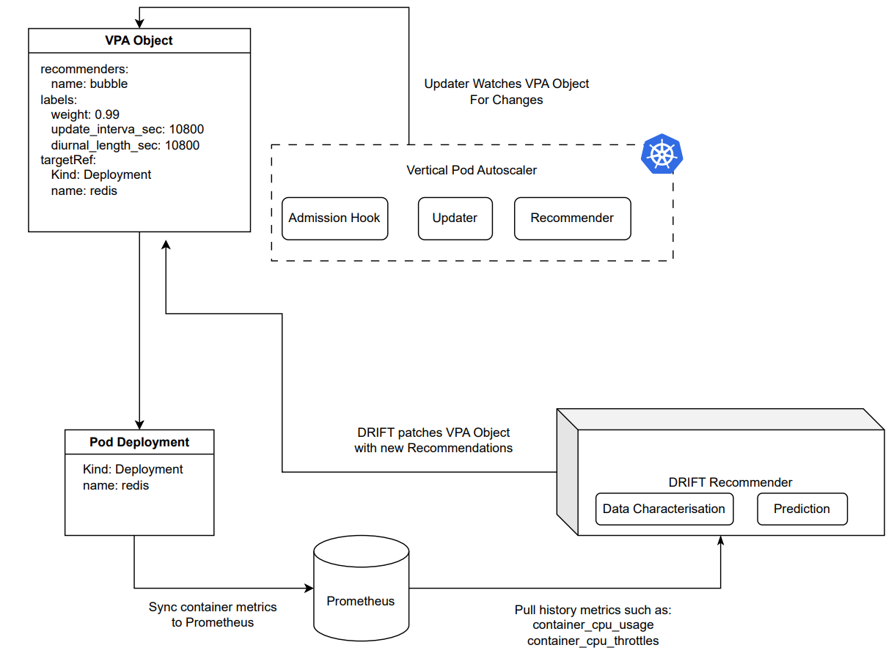

# Table of Contents
1. [Repository Overview](#repository-overview)
2. [Architecture](#architecture)
3. [Installation](#installation)
4. [Algorithm Description](#algorithm-description)

# Repository Overview

PAWS-VPA repository includes set of VPA recommendation algorithms that can be used to scale kubernetes pod resources by 
providing optimal resource recommendations.

# Architecture

The main components of the PAWS-VPA are: 

- DRIFT Recommender: Host algorithms to provide recommendations for running pod
- Prometheus: Serves as a central repository to pull historic data for the DRIFT recommender to process recommendation.
- PROM Crawler: Scrapes metrics from Prometheus and provide them as imput to DRIFT recommender.
- VPA object: We have added optional custom labels to the VPA object to enable various PAWS vpa optimisation.

# Installation
For installation instructions please visit [Installation](docs/install.md)

# Algorithm Description
For detailed description of our VPA algorithm, please refer to our [algorithm](docs/algorithm.md) guide.

# Credit
Part of this work is inspired by [Openshift's VPA work](https://github.com/openshift/predictive-vpa-recommenders)
